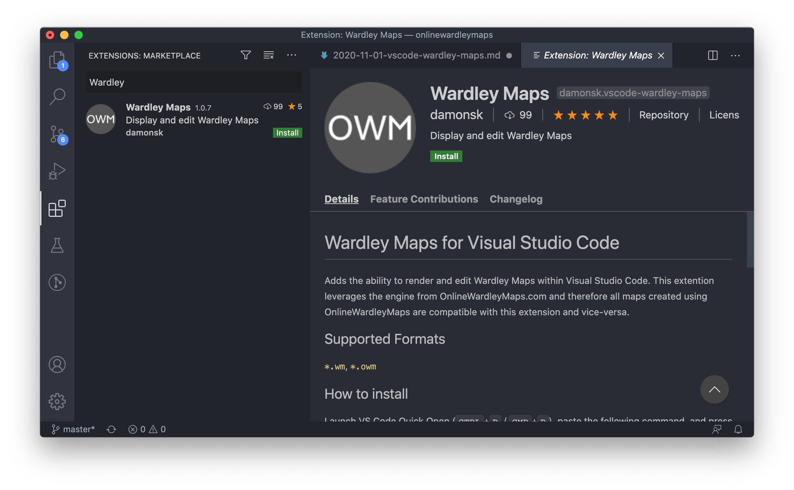
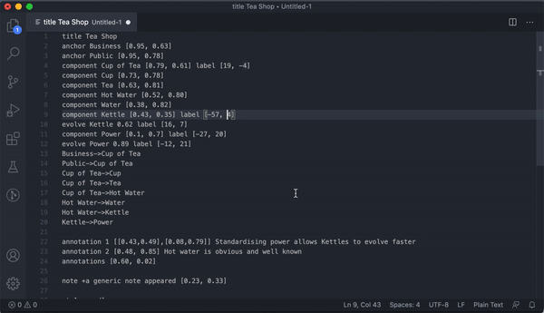
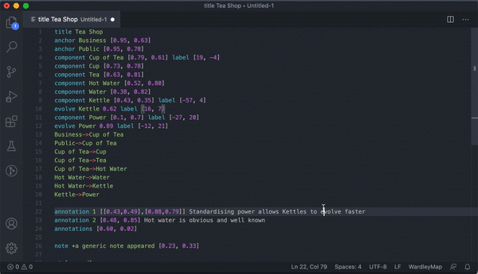
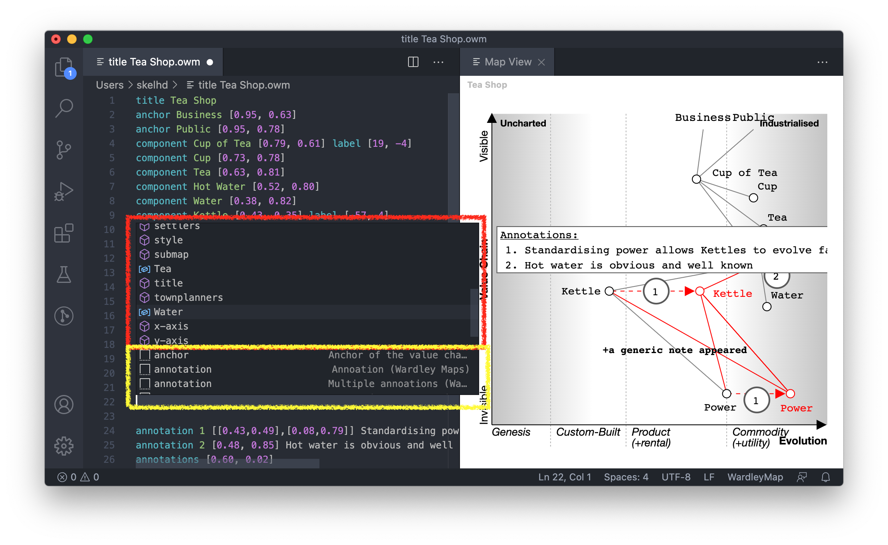

Wardley Maps for Visual Studio Code is a Wardley Map generator. It takes map code written in the editor and renders it as a Wardley Map.  You can interact with the map by repositioning components by dragging or dropping.  Changes made via the rendered map are reflected back into your map code.

## Quick Links

- [Getting Started](#getting-started)
- [Get the extension](#get-the-extension)
- [Using the extension](#using-the-extension)
  - [Syntax Highlighting](#syntax-highlighting)
  - [Displaying Maps](#displaying-maps)
  - [Auto Completions](#auto-completions)
  - [Snippets](#snippets)

## Getting Started

First, you need to make sure you have Visual Studio Code installed.  [Skip ahead](#get-the-extension) if you're already setup.  

Head over to [https://code.visualstudio.com/download](https://code.visualstudio.com/download) and download and install the version for your operating system.

## Get the extension

Once Visual Studio Code is installed and running, search and install Wardley Maps extension from the Extensions panel. To get to the Extensions panel, from the file menu, select `View` -> `Extensions`.  You can also use the keyboard shortcut (Windows) `Ctrl+Shift+X` (macOS) `Cmd+Shift+X`.

Simply search for and install the extension `Wardley Maps` shown below.

**Alternatively**, if you are familiar with VSCode, you can shortcut this process by entering the following command into the Command Palette ((Windows) `Ctrl+Shift+P` / (macOS) `Cmd+Shift+P`).  `ext install damonsk.vscode-wardley-maps`

## Using the extension

- [Syntax Highlighting](#syntax-highlighting)
- [Displaying Maps](#displaying-maps)
- [Auto Completions](#auto-completions)
- [Snippets](#snippets)

### Syntax Highlighting

To reduce the cognitive load when reading maps as code, this extension brings with it syntax highlighting.  

To enable syntax highlighting, you have two options.  By default, any file with an extenion of `.wm` or `.owm` will auto enable the syntax highlighting.

For existing files, or new unsaved files, you can set the Language Mode.

Using the Command Palette (keyboard shortcut: (Windows) `Ctrl+Shift+P` (macOS) `Cmd+Shift+P`) enter `Change Language Mode`, press enter and then select `Wardley Map`

### Displaying Maps

Using the Command Palette (keyboard shortcut: (Windows) `Ctrl+Shift+P` (macOS) `Cmd+Shift+P`) enter `Wardley Maps: Display Map` and then press enter.

### Auto Completions

To access the code completions (or intellisense) within the text editor, press `Ctrl+Space`.  Code completions (shown in red below) will contain both the keywords (such as `component` `anchor` `ecosystem`) as well as any variables specific to your map.  For example, `component Hot Water [...]` will result in a variable `Hot Water`.  Variables can be used to link components in a value chain.  `Hot Water->Water`

### Snippets

Similar to code completions, to access snippets within the text editor, press `Ctrl+Space`.  Snippets (shown in yellow below) are complete examples which you can modify, you may `tab` between placeholders for quick editing.  

The following snippet `anchor name [0.9, 0.1]` has three placeholders.

`anchor <initial text cursor> [<tab to edit>, <tab again to edit>]`

## License & Source

This project is licensed under the [MIT license](https://github.com/damonsk/vscode-wardley-maps/blob/master/LICENSE) and the source code can be found at [github.com/damonsk/vscode-wardley-maps](https://github.com/damonsk/vscode-wardley-maps).

## Support the Project

If you find [obsidian-wardley-maps](https://github.com/damonsk/obsidian-wardley-maps), [OnlineWardleyMaps](https://github.com/damonsk/onlinewardleymaps) or [vscode-wardley-maps](https://github.com/damonsk/vscode-wardley-maps) valuable, consider supporting its development:

Follow on X (Twitter) [@MapsAsCode](https://x.com/mapsascode) for updates and announcements!

Your support helps maintain and improve this plugin as well as OnlineWardleyMaps and vscode-wardley-maps. Every contribution is appreciated. Thank you for your support!