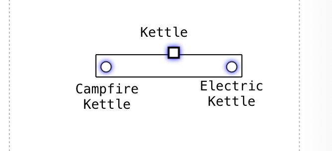
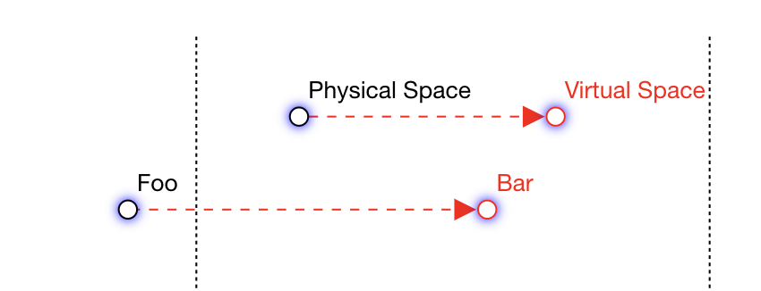
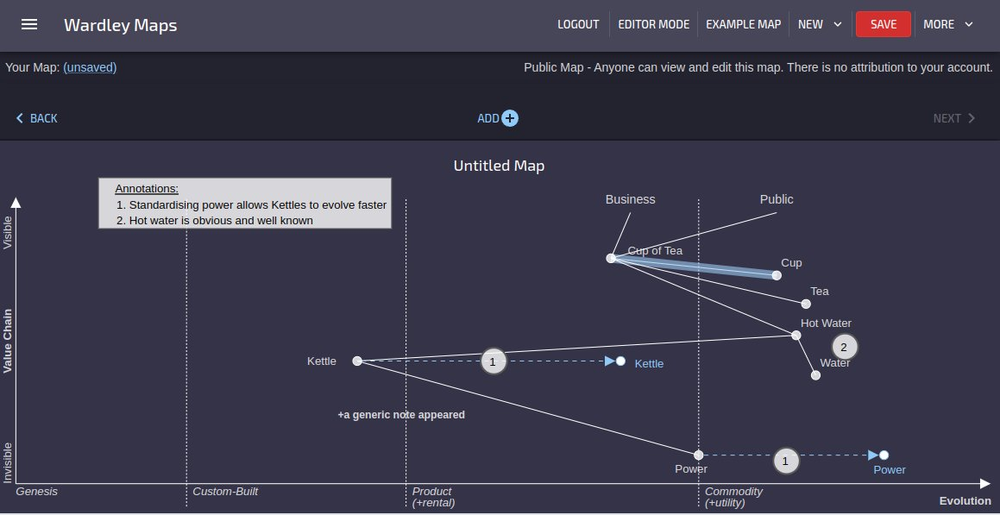
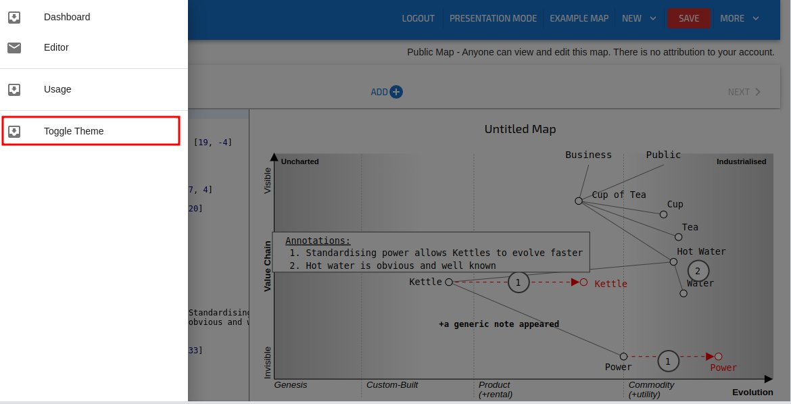
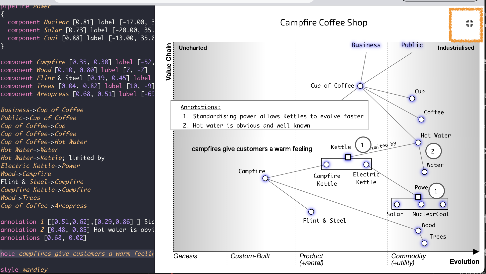
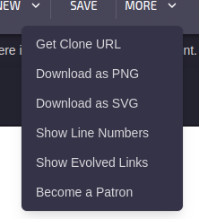

Welcome to the December release of OnlineWardleyMaps.  Major release to bring Quality of Life improvements and new features.

## New Features

### Pipelines V2

We've revamped the pipeline components to enhance the positioning of choice components. This improvement introduces a new syntax, detailed below.

#### Key Highlights:

##### Improved Positioning:
Experience enhanced placement of choice components within your pipelines for a more streamlined and intuitive workflow.

##### New Syntax:
Explore the updated syntax that accompanies this change, providing you with a more expressive and efficient way to define your pipeline components.

##### Backward Compatibility:
Fear not! Both the new and old syntax will be supported, ensuring a smooth transition for all users.


#### Legacy syntax & view

The old syntax created a view which positioned two components at the given maturity.


```
pipeline Kettle [0.1, 0.9]
```


#### Version 2 syntax & view

New version allows nested components which only require their maturity to be specified as they will inherit visibility position from the parent pipeline.

```
component Kettle [0.45, 0.57]
pipeline Kettle
{
  component Campfire Kettle [0.50]
  component Electric Kettle [0.63]
}

```



[View an example map which highlights the changes](https://beta.onlinewardleymaps.com/#clone:703Ni4Dth65U1mJBCf)

### Annotate value chain links

You can now specify additional context to links by using the optional operator.  This will allow you to highlight which links are "limited by", "constraint" or "feedback loop" without using notes.  Example below.

```
Hot Water->Kettle; limited by 
```


### Evolve name changes

It may be the case that the evolved component will need to represent something new. 

Like Physical Space to Virtual Space. 

You can now specify the new name of the evolved component using the syntax below.  Virtual Space will be the new component name.

```
component Physical Space [0.91, 0.46]
evolve Physical Space->Virtual Space 0.8
```




[View an example map which highlights the changes](https://onlinewardleymaps.com/#clone:evolve-name-change)

### Map Iterations

Iterations represent a significant evolution in the way you interact with your Wardley Maps. They allow you to capture the dynamic nature of your landscape over time, enabling a richer and more detailed representation of the evolution of your strategic elements.

#### Possible uses:

##### Time-Phased Evolution:
With Iterations, you can now create snapshots of your Wardley Map at different points in time, capturing the evolution of components, relationships, and strategies.


##### Enhanced Strategic Planning:
Plan and visualize the future states of your landscape by creating iterations that depict the expected evolution of your components and their interdependencies.


##### Historical Insights:
Gain valuable insights into the historical development of your landscape by navigating through different iterations, allowing you to analyze trends, patterns, and the effectiveness of strategic decisions over time.

##### Improved Collaboration:
Collaborate seamlessly with your team by sharing and discussing specific iterations, fostering a shared understanding of the evolving landscape and supporting strategic decision-making.

##### Effortless Mapping Updates:
Easily update and modify your Wardley Map in each iteration, reflecting changes and adaptations as your landscape evolves.

Iterations empower you to move beyond static representations, allowing you to embrace the dynamic nature of strategic planning. By incorporating time-phased evolution into your Wardley Maps, you can make informed decisions, adapt to change, and drive success in an ever-evolving landscape.


## Quality of Life Improvements

### Facelift & Light/Dark Themes

OWM has moved away from Bootstrap and now using MaterialUI.  With this change comes a more modern look and feel. 

#### Dark / Light modes.

By default, OWM will load using a dark theme, including the editor.  You can also take advantage of dark maps by using the ``style dark``.

You can toggle light/dark theme from the left hand menu. 





### Classic Online Wardley Maps

Not ready to move across?  You can still access the old website - [https://classic.onlinewardleymaps.com](https://classic.onlinewardleymaps.com)


### Unsaved Changes 

Using the browser, the user will be prompted if they navigate away when there are outstanding map changes.  This one gets me all the time.

### Presentation / Editor Mode 

This will allow you to hide the map text / editor to give a fullscreen view of the map.  This will also allow maps to be viewed from a mobile device in portrait mode.


### Fullscreen mode.

Remove the header and iterations and go fullscreen with your map and editor.  You can also use this with Presentation mode leaving you with just your map.



### Export as SVG

Now you can take your maps and load them directly into your favorite SVG editor. This feature empowers you to further customise and refine your maps using the tools you love.



## Bugfixes 

### Changes to drag/drop

A bug manifested after elements on the map are moved followed by a ESC key press later on.  The keypress would incorrectly revert the moved element often making the map appear broken.
 
### Usage Guide

Until today, the documentation website (this website) was not accessible via the onlinewardleymaps.com website.  A navigational link has been added into the "More" menu (top right) and in the footer.