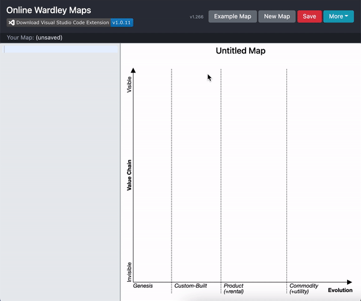

# Quick Add & Quick Link

OnlineWardleyMaps supports quick ways to add and link components directly on the map, improving your workflow and reducing the need to edit code manually.

## Quick Add

Double-click anywhere on the map to quickly place a new component. A dialog will appear to enter the component name. Press <kbd>Enter</kbd> to add or <kbd>Escape</kbd> to cancel.

## Quick Link

You can quickly link components visually:

1. Press and hold <kbd>CTRL</kbd> (or <kbd>CMD</kbd> on macOS).
2. Click the start component.
3. Move your mouse to the end component.
4. Click the end component.
5. Release <kbd>CTRL</kbd>/<kbd>CMD</kbd>.

A link will be created between the two components. If you release <kbd>CTRL</kbd>/<kbd>CMD</kbd> at any point, the linking process will cancel.

## Visual Example

---

For more details, see the [May 2021 Release Note](../../blog/2021-05-15-release-note/index.md).

<!-- moved to map-features/features-quick-add-link.md -->
