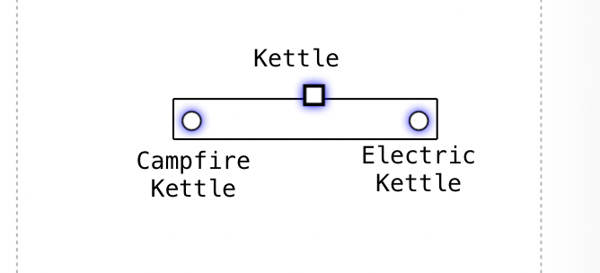
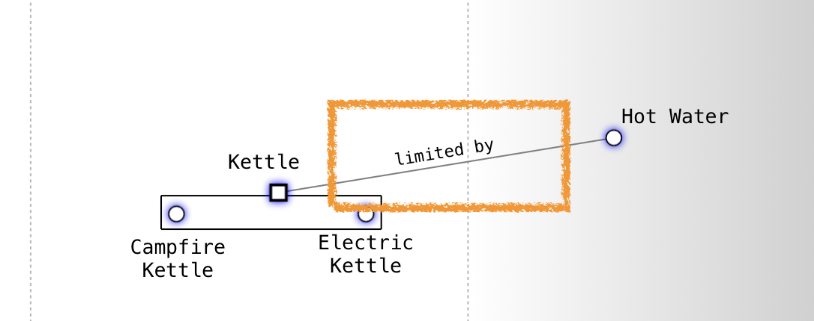

# Pipeline

A **pipeline** represents a flow or process that connects components across stages of evolution. Pipelines are used to simplify the notation of complex requirement chains, making maps easier to read and understand.

> "Sometimes, there are many similar ways to accomplish the same thing... you might use a pipeline to simplify the notation." ([wardleymaps.com](https://www.wardleymaps.com/intro))

## Syntax

Pipelines allow for nested components which inherit their visibility position from the parent pipeline. Components within a pipeline only need to specify their evolution (X axis) position.

```text
component ParentName [Y Axis, X Axis]
pipeline ParentName
{
  component SubComponent1 [X Axis]
  component SubComponent2 [X Axis]
}
```

### Example

```text
component Kettle [0.45, 0.57]
pipeline Kettle
{
  component Campfire Kettle [0.50]
  component Electric Kettle [0.63]
}
```

### Visual Example



**Tip:** Use pipelines to clarify and condense complex flows in your map. This syntax provides better control over component positioning and allows for more structured representation of related components.

## Annotations

You can add context to pipeline links using annotations. This allows you to highlight relationships such as "limited by", "constraint", or "feedback loop" without using additional notes.

### Annotation Syntax

```text
ComponentA->ComponentB; limited by
```

### Annotation Example

```text
Hot Water->Kettle; limited by
```

### Visual Example



These annotations help provide additional context about the relationships between components in your pipeline, making the map more informative and easier to understand.

## Legacy Syntax

:::note
This is the legacy syntax for pipelines. While still supported, we recommend using the current syntax shown above for better control and clarity.
:::

```text
pipeline Component Name [X Axis (start), X Axis (end)]
```

- **Component Name**: The element being pipelined.
- **X Axis (start)**: Where the pipeline begins on the evolution axis.
- **X Axis (end)**: Where the pipeline ends on the evolution axis.

### Legacy Example

```text
pipeline Customer [0.15, 0.9]
```
